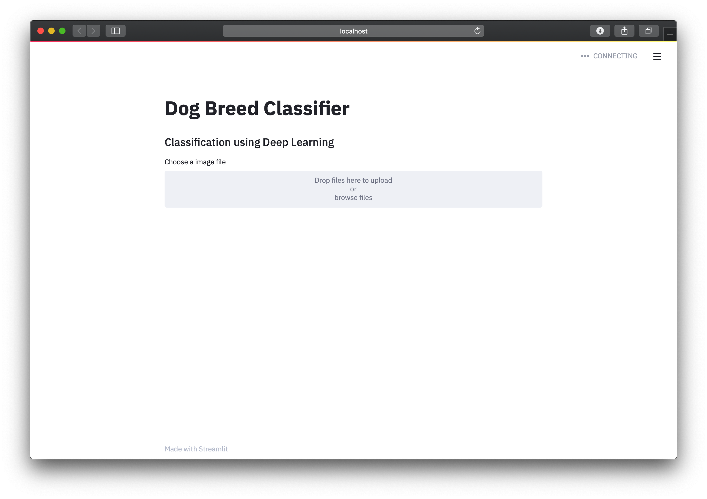

# Dog Breed Classification Project Using Flask

Dog Breed classifier project. A Web Application is developed using Streamlit through which a user can check the breed of dog. Also, if the uploaded image is that of a human, the algorithm tells the user what dog breed the human resembles the most. The Deep Learning model distinguishes between the 133 classes of dogs with an accuracy of over 82.89%.

Medium Article Published in Towards Data Science- https://towardsdatascience.com/dog-breed-classification-using-flask-ef99259d38c


### Home Page




### Prediction using Deep Learning


## Steps Involved:

1. Import Datasets
2. Detect Humans
3. Detect Dogs
4. Create a CNN to Classify Dog Breeds (from Scratch)
5. Use a CNN to Classify Dog Breeds (using Transfer Learning)
6. Create a CNN to Classify Dog Breeds (using Transfer Learning)
7. Writing the Pipeline
8. Testing the Pipeline
9. Creating a Flask application for the same in which a user can upload an image and see the results.

## Libraries Used:

1. Python 3.7+
2. Keras
3. OpenCV
4. Matplotlib
5. NumPy
6. glob
7. tqdm
8. Scikit-Learn
9. Streamlit
10. Tensorflow

## Project motivation:
The goal of this project is to classify images of dogs according to their breed. When the image of a human is provided, it recommends the best resembling dog breed. I decided to opt for this project as I found the topic of Deep Neural Networks to be very fascinating and wanted to dive deeper into this with some practical work.

## Description of repository:
The repository consists of the Jupyter Notebook files in format: dog_app.ipynb. Moreover there are files for the web application developed using Streamlit and contains all code necessary for running the dog breed classifier app on the local machine.

## Running the code:
For running the web app on local machine, following these instructions:

1. Make sure you have all necessary packages installed.
2. Git clone this repository
3. Within command line, cd to the cloned repo, and within the main repository.
4. Run the following command in the parent directory to run the web application. 

```
streamlit run run.py
```

Go to http://localhost:8501/ to view the web app and input new pictures of dogs or humans – the app will tell you the resembling dog breed successfully without any errors.

## Project Definition:
The task was to develop an algorithm that takes an image as an input, pre-processes and transforms the image so that it can be fed into a CNN for classifying the breed of the dog. If a human image is uploaded, it should still tell the user what dog breed the human resembles most.

## Analysis of the Project:

I decided to use a pre-trained ResNet50 model as this has shown very good results with regard to accuracy for image classification. In the provided classroom environment, my tests showed an a test accuracy of 82.8947%. This was accomplished by 25 epochs which ran very quickly on the provided GPU. 


### Dataset Exploration:

The datasets are provided contains dog images for training the models and human faces for detector. After loading both the dataset using sklearn, the following conclusions are drawn:

1. There are 133 total dog categories.
2. There are 8351 total dog images.
3. There are 6680 training dog images.
4. There are 835 validation dog images.
5. There are 836 test dog images.
6. The are in total 13233 human images.

### Review:

1. An example of human detection is provided in the following image:

Human is detected in the following image.


2. Even humans will find it difficult to tell the difference between the two dog classes in some categories. An example is shown below:


Brittany Breed


Welsh Springer Spaniel Breed

3. Also, more distinguishing/challenging categories are shown.


## Conclusion:
I was surprised by the good results of the algorithm i.e. Resnet50. Without doing too much fine-tuning, the algorithm was already providing high accuracy and the predictions were mostly correct. An accuracy of over 80%. For human faces it seems easier if the face has distinct features that resembles a certain dog breed. Otherwise, it starts to guess from some features, but the results vary. For higher accuracy, the parameters could be further optimized, maybe also including more layers into the model. Further, number of epochs could be increased to 40 to lower the loss. Also by providing an even bigger training data set, the classification accuracy could be improved further. Another improvement could be made with regard to UI.

## Results:

Using the final model, some examples of predictions are shown below. If a photo of a human is uploaded, it tells the closest match.

#### Prediction: This photo looks like an Afghan hound.


#### Prediction: The predicted dog breed is a Brittany.


#### Prediction: The predicted dog breed is a Boykin spaniel.


#### Prediction: The predicted dog breed is a Curly-coated retriever.


#### Prediction: The predicted dog breed is a Labrador retriever.


